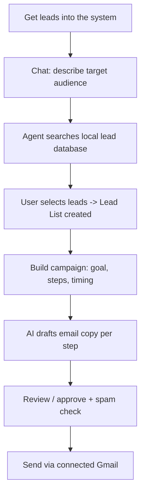

# Agent Flow

## What it is
A chat-driven agent that takes a business's ideal customer profile, finds matching leads, drafts a multi-step outreach email, sends it — end to end through one conversational interface.

## End-to-end flow

1. **Get leads in** — via the Upload Leads page (Excel/CSV import).
2. **Chat with the agent** — user describes who they're targeting (role, industry, location). The agent extracts structured search filters from the conversation.
3. **Search** — the agent searches leads already in the database matching those filters and returns a ranked list.
4. **Select** — user picks how many leads to use (e.g. top 25%/50%/100%); this creates a Lead List.
5. **Build campaign** — user and agent collaborate on campaign goal and sequence (number of steps, timing between them).
6. **Generate copy** — AI drafts the email content for each step, tailored to the business profile and lead.
7. **Review & approve** — user edits/approves; an automated spam-risk check runs before sending.
8. **Send** — emails go out through the user's connected Gmail account (OAuth).

## Agent Architecture

Two apps split the work: `agent_runtime` owns the conversation (routing, state, memory), `api` owns the business logic the conversation ultimately calls into.

**Turn lifecycle** (one chat message, end to end):
1. Frontend calls `conversation/message/` → `TurnManager` logs the user event and hands off to `RootOrchestratorAgent`.
2. `IntentRouterAgent` classifies the message into `chit_chat`, `lead_search`, or `create_campaign` (an LLM call, result cached so repeated phrasing skips re-classification). Runs in parallel with a campaign-state pre-warm for latency.
3. `RootOrchestratorAgent` picks the matching sub-agent — agents are created lazily, only the one actually used pays init cost.
4. The sub-agent does its job (extract search filters, advance the campaign flow, or just converse) and updates session state via `FlowStateMachine`, which also caps how many clarification questions can be asked in a row before falling back to sensible defaults — this is what keeps the conversation from looping.
5. Every step (intent, agent selection, response, errors) is written to an event log (`AgentRepository`) — this is what powers the "conversation history" replay and debugging.
6. The result is normalized by `response_mapper` into a stable contract (`reply`, `current_flow`, `slots`, `next_action`, etc.) so the frontend never has to know which internal agent handled the turn.

**Lead sourcing is pluggable by design.** `LeadSourceRouter` picks a provider by name and normalizes whatever it returns into one shape. Today only the upload-backed local database is populated; the router/provider interface is what an external API would plug back into later without touching the conversation layer.

**Key modules:**
| Path | Responsibility |
|---|---|
| `agent_runtime/orchestrator/` | Turn lifecycle, intent routing, per-session state machine |
| `agent_runtime/agents/` | One class per conversational flow (chit-chat, lead search, campaign) |
| `agent_runtime/tools/` | Lead-source provider routing/normalization |
| `agent_runtime/persistence/` | Event-sourced session/state storage |
| `agent_runtime/mapping/` | Keeps the frontend response shape stable regardless of internal changes |
| `api/services/` | The actual business logic: lead search/scoring, campaign + email generation, Gmail send |
| `api/models.py` | Leads, Campaigns, SentEmails, Replies, Conversation state |

## Current state / notes for context
- **No external lead-search API is connected.** A prior integration (Apollo) was removed; "search leads" in chat only searches leads already imported via upload — it does not pull new leads from the internet yet.
- **Local dev setup**: running against a local SQLite database (previously a shared remote database).

## Requirements to Run

| Requirement | Needed for | Cost |
|---|---|---|
| **Python 3.12+, pip deps** (`requirements.txt`) | Everything | Free |
| **OpenAI API key** (`OPENAI_API_KEY`) | Intent routing, campaign/email generation, filter extraction, normalizing search filters (job titles, locations, keywords) to a canonical taxonomy via embedding similarity — the agent's "brain" | **Paid** — pay-as-you-go per token, no persistent free tier (new accounts sometimes get small trial credit) |
| **Gmail sending** — pick one: | Actually sending campaign emails | |
| &nbsp;&nbsp;• App Password (`from_email` + 16-char app password, per user, via Settings in the UI) | Simple per-user sending | **Free** — just needs 2-Step Verification enabled on the Gmail account |
| &nbsp;&nbsp;• Google OAuth Client (`GOOGLE_CLIENT_ID`, `GOOGLE_CLIENT_SECRET` from Google Cloud Console) | "Connect Gmail" button (OAuth login + send) | **Free** to create, no billing required for this usage level |
| **Database** | Storing leads/campaigns/conversations | Free — local SQLite by default, no key needed |

**Minimum to just try the agent locally:** Python deps + an OpenAI key. Gmail sending can be added when you actually need real sending.
